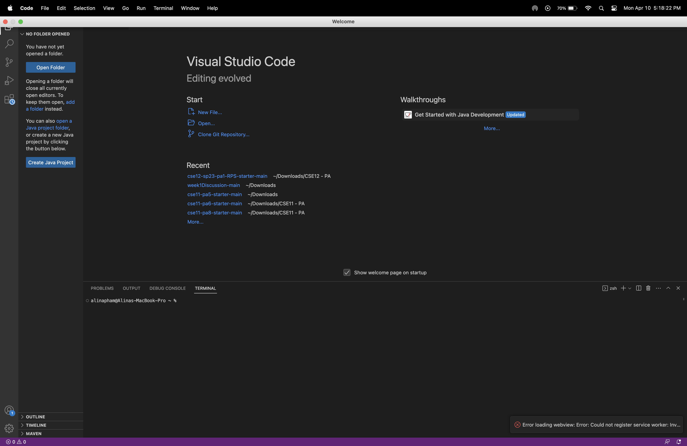
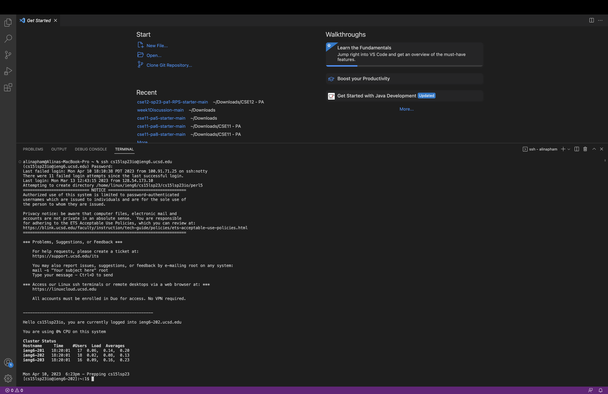
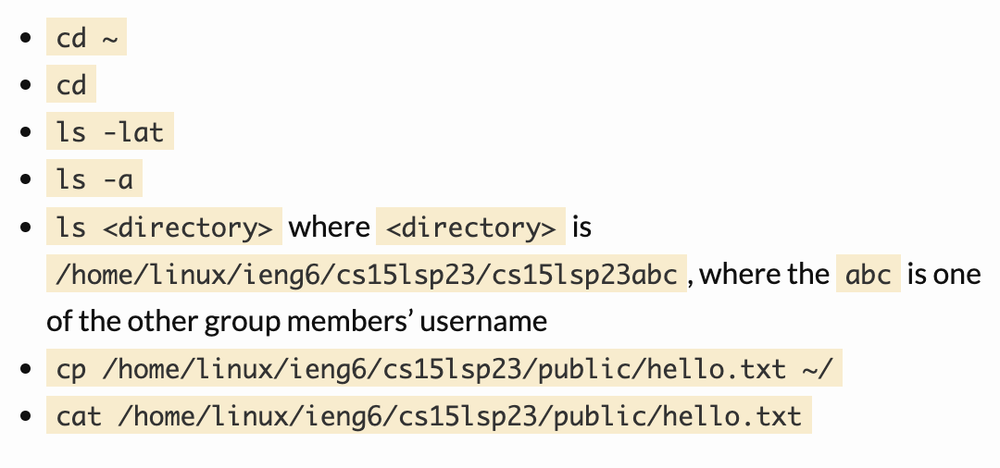
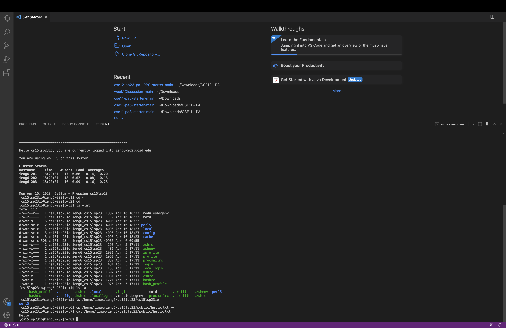

# Lab Report 1 - Remote Access and File System (Week 1)
---

## Installing VScode
In this section, I will be explaining how to install VScode on a macbook.

* The first step is to search up vscode online. Or just click on the link provided below to get to the website.
[VScode](https://code.visualstudio.com/)
* Once you click the download button; you will be given 3 options to choose from. Choose the one that best fits your type of computer.
* After VScode has finished downloading, you will find it in the finder of you macbook. Click on the VScode icon in your downloads folder.
* A message will pop up asking if you are sure you want to open VScode up. When the message pops up, click open.
* Finally, you can now open VScode on your desktop. It will look similar to the image shown below.

---

## Remotely Connecting
In this section, I will be explaining how to connect remotely.

* Open VScode and open a new terminal by hovering on terminal on the upper lefthandside of your screen and clicking on new terminal.
* Then write or copy and paste into your terminal `ssh cs15lsp23zz@ieng6.ucsd.edu` but change `zz` with the letters for your course specific account.
* If a message pops up asking for you to type yes or no, type in `yes`.
* If successful, you should see a similar message as the one shown below.

---

## Trying Some Commands
In this section, I will be explaining how to write commands and which commands to try in your terminal.

* Once you have logged in your remote server there are different commands you can try out in your terminal.
* Start of by writing different commands like; cd, ls, pwd, mkdir, and cp to see what each command does.
* You can also try out the list of commands shown below.

* Once you write those commands listed above, you should have something similar to what is shown below.

