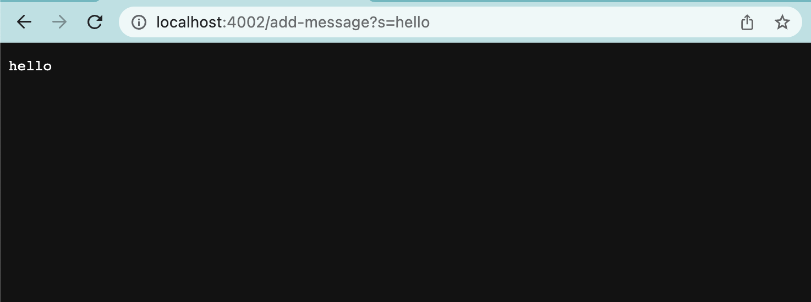
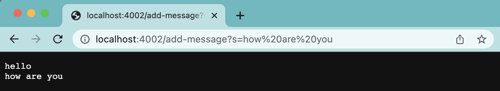
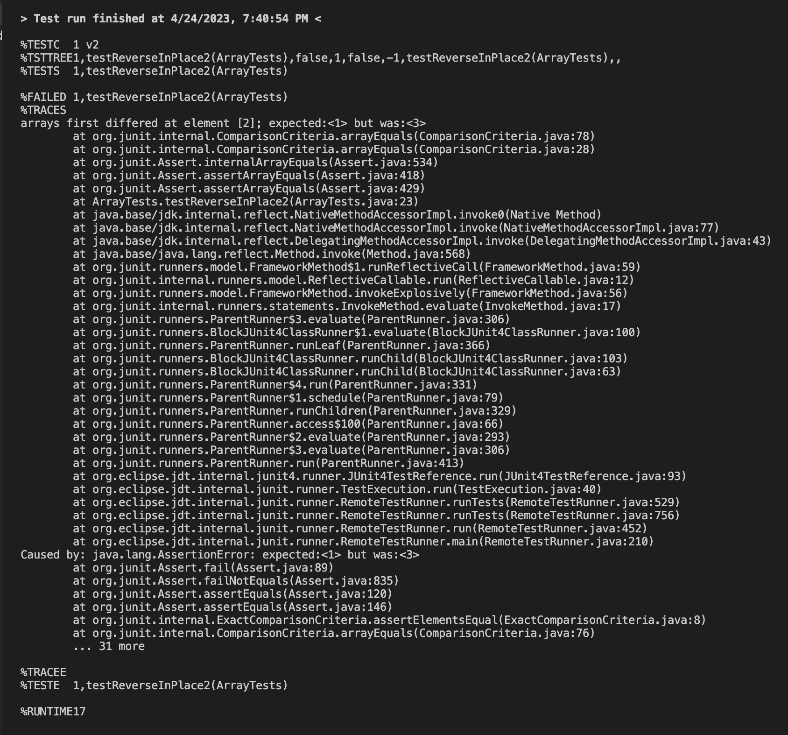
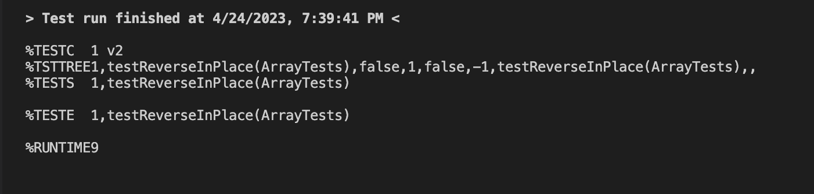

# Lab Report 2 - Servers and Bugs (Week 3)

## Part 1
The code for `String Server`
```
import java.io.IOException;
import java.net.URI;

class Handler implements URLHandler {
    String input;
    int num = 0;

    public String handleRequest(URI url) {
        if (url.getPath().equals("/add-message?s="+ input)) {
            return String.format("\n" + input);
        } else if (url.getPath().equals("/increment")) {
            num += 1;
            return String.format("Number incremented!");
        } else {
            System.out.println("Path: " + url.getPath());
            if (url.getPath().contains("/add")) {
                String[] parameters = url.getQuery().split("=");
                if (parameters[0].equals("count")) {
                    return String.format("Number increased by %s! It's now %d", parameters[1], num);
                }
            }
            return "404 Not Found!";
        }
    }
}

class StringServer {
    public static void main(String[] args) throws IOException {
        if(args.length == 0){
            System.out.println("Missing port number! Try any number between 1024 to 49151");
            return;
        }

        int port = Integer.parseInt(args[0]);

        Server.start(port, new Handler());
    }
}
```

`/add-message?s=hello`

* The handleRequest method is being called.
* The relevant arguments to those methods are the first and second if statements.
* No values got changed because all the method does is just input the message on the screen.

`/add-message?s=how are you`


* The handleRequest method is being called.
* The relevant arguments to those methods are the first and second if statements.
* No values got changed because all the method does it just input the message on the screen.

## Part 2
**Symptoms and Failure-inducing Inputs (Array Methods - `reverseInPlace`)**

Failure-inducing input
```
@Test
  public void testReverseInPlace2() {
    int[] input1 = {1, 2, 3};
    ArrayExamples.reverseInPlace(input1);
    assertArrayEquals(new int[]{3, 2, 1}, input1);
  }
```

output


Input that doesn’t induce a failure
```
@Test 
	public void testReverseInPlace() {
    int[] input1 = { 3 };
    ArrayExamples.reverseInPlace(input1);
    assertArrayEquals(new int[]{ 3 }, input1);
	}
```

output



Before Fix
```
static int[] reversed(int[] arr) {
    int[] newArray = new int[arr.length];
    for(int i = 0; i < arr.length; i += 1) {
      arr[i] = newArray[arr.length - i - 1];
    }
    return arr;
  }
```

After Fix
```
 static int[] reversed(int[] arr) {
    int[] newArray = new int[arr.length];
    for(int i = 0; i < arr.length; i += 1) {
      newArray[i] = arr[arr.length - i - 1];
    }
    return arr;
  }
```

## Part 3
**What did I learn these past weeks?**
These past few weeks I learned about URls and servers. I now understand the different components that make up webservers like domain and path.
The domain being the part of the URL after the https:// and before the first slash. The path being the part after the domain and before the ?.
