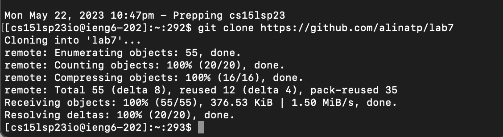
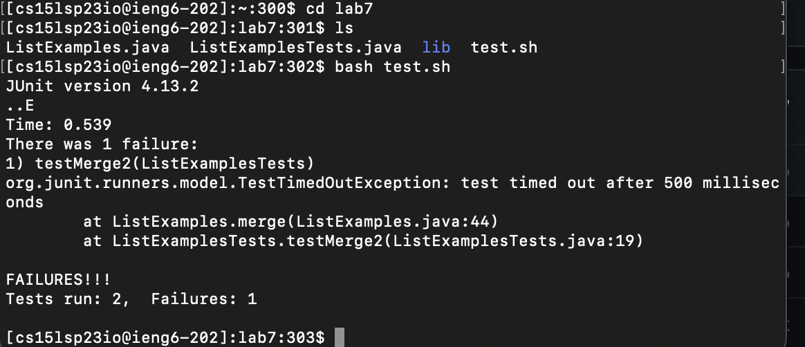
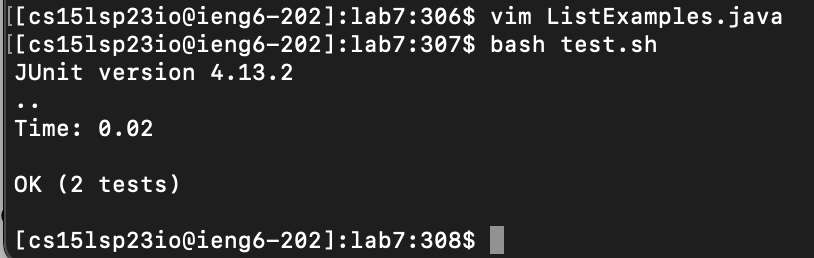
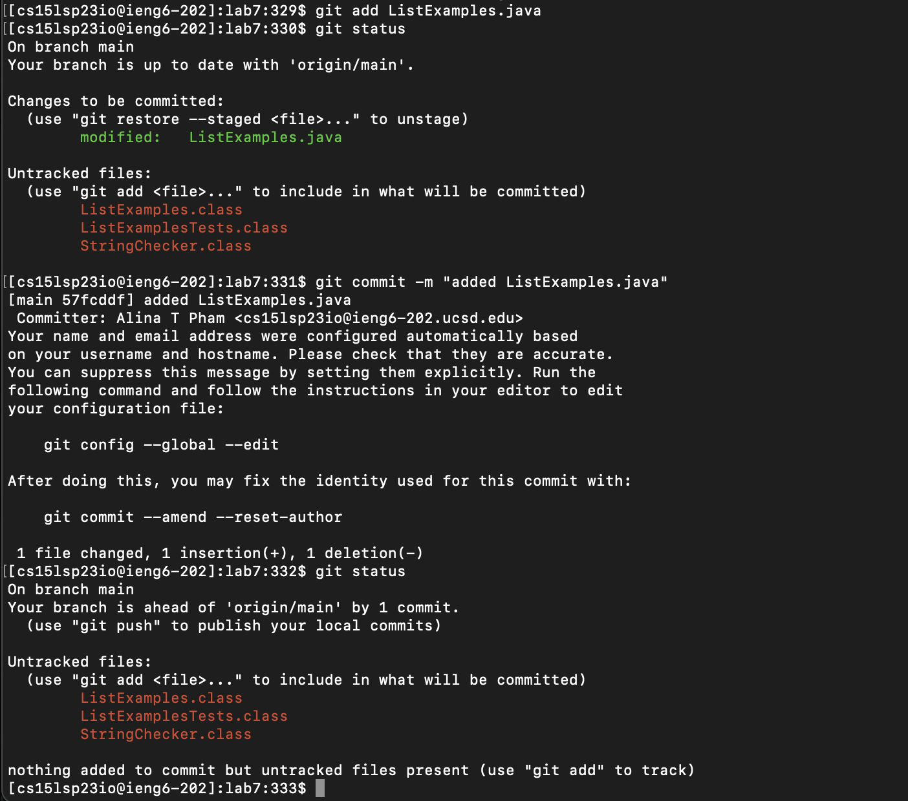

# Lab Report 4 - Command Line Tasks

**Step 4** 
Log into ieng6

Keys Pressed: type in the terminal `ssh cs15lsp23io@ieng6.ucsd.edu`. (the `io` can be changed to your specific account).
Then press `<Enter>`.

---

**Step 5** 
Clone your fork of the repository from your Github account

Keys Pressed: Type in the terminal `git clone https://github.com/alinatp/lab7`. Then press `<Enter>`.

---

**Step 6** 
Run the tests, demonstrating that they fail

Keys Pressed: First type `cd lab7`. then press `<Enter>`. Then `ls` to see all the files. Then type in `bash test.sh`. 
Then press `<Enter>`.

---

**Step 7** 
Edit the code file `ListExamples.java` to fix the failing test (as a reminder, 
the error in the code is just that `index1` is used instead of `index2` in the final loop in `merge`)

Keys Pressed: To enter to file you type in `vim ListExamples.java`. Then press `<Enter>`. Once you are in the file
press `<up><up><up><up><up><up><Enter>`. Then press `i` to edit the file. Press `<right><right><right><right><right><right><right><right><delete><2><esc>`. Then to save and exit I typed `<:wq`.

---

**Step 8** 
Run the tests, demonstrating that they now succeed

Keys Pressed: I typed in `bash test.sh`. Then press `<Enter>`.

---

**Step 9** 
Commit and push the resulting change to your Github account

Keys Pressed: I types in `git add ListExamples.java`. Then `git status` to check on the status. The I wrote `git commit -m "added ListExamples.java"`.
Then wrote `git status` once more to check that it has successfully commited. 

