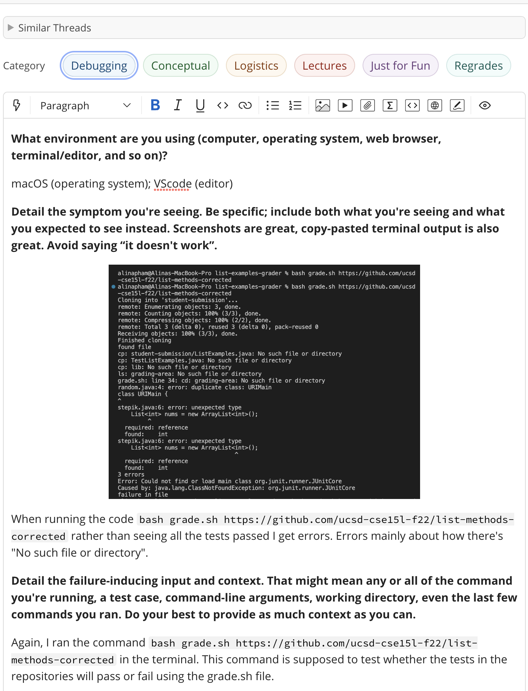
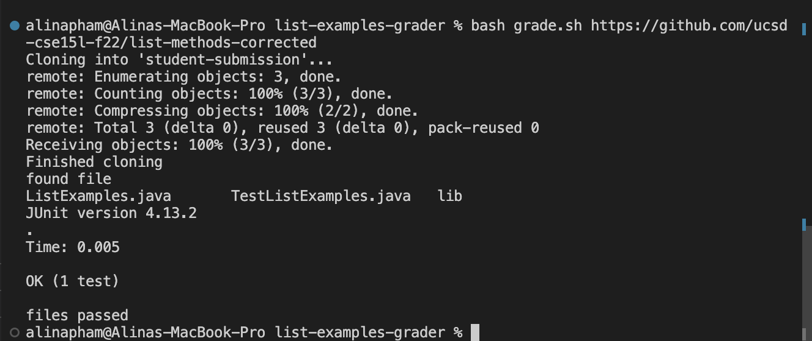
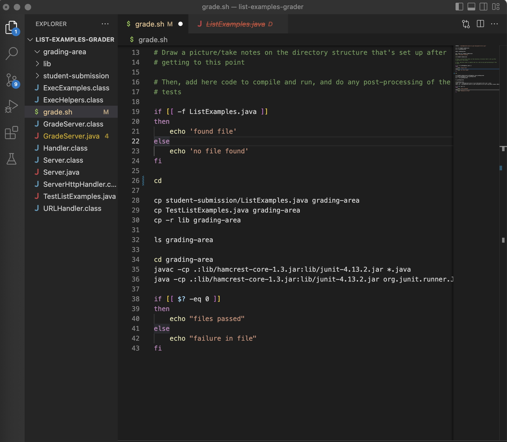
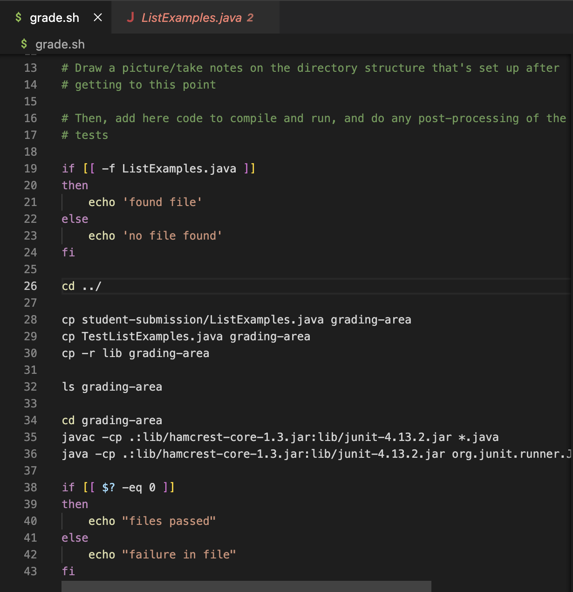

# Lab Report 5 - Debugging Scenario & Reflection

**Edstem Conversation**

**Student Implementation of Response**

The bug came from line 26 in the grade.sh file. The line was orginally just `cd`. Changing the code to `cd ../` fixed the error.

**The Setup**
Before Fixing the Bug

Command Line Used to Trigger Bug
`bash grade.sh https://github.com/ucsd-cse15l-f22/list-methods-corrected`

**After Fixing the Bug**

How to fix the bug:
Go to line 26 and add `../` after `cd`. So lin 26 will end up being `cd ../`.

**Reflection**
From my lab experience in the second half of this quarter that I didn't know before is vim. While we did learn about vim in lecture, I believe I got to learn a lot more about vim in our lab section. While admittedly, I do have some more learning to do on vim, the things I have learned so far have been interesting. Like how to use vim to both edit and run code. As well as shortcuts when using vim. I'm excited to see how I can use vim more in the future!
